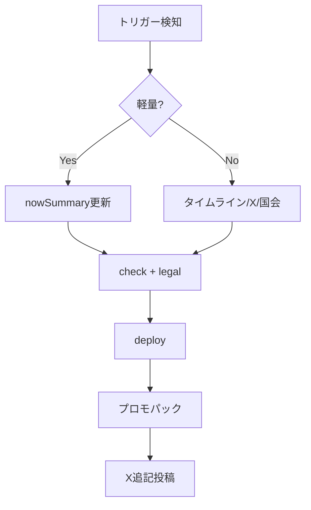

# 過去記事の更新ルーティン

最終更新: 2026-06-30  
対象: **既公開案件**に追記・修正が必要なとき

関連: `docs/publish-routine.md`（新規公開）· `docs/content-visual-strategy.md` · `docs/writer-editorial.md`

---

## 基本方針 — 二層構造（2026-06-30）

| レイヤー | 方針 | 読者への見え方 |
|----------|------|----------------|
| **タイムライン**（国会・X・出来事） | **追記のみ**。既存行は原則いじらない | 年表が伸びる |
| **いまの結論**（nowSummary） | **上書きOK**。`updatedAt` 必須 | 「いま」が更新される |
| **初公開日** | **固定** | `publishedAt` は変えない |
| **タイトル** | **原則固定**。変えるときは履歴を残す | 下記「タイトル」 |

**例外（既存行の修正可）:** 誤字 · 404 · 法務指摘 · X「削除済み」注記の追加（行は消さない）

**CEO・スクリプト:** `enrich-timeline-all` は不足分の補完用。**国会3件済みの案件に新発言を自動で足す処理はしない**（追記は意図的に手動）。

---

## いつ更新するか（トリガー）

| トリガー | 例 | 優先度 |
|----------|-----|--------|
| **国会で新発言** | 予算委・法案審議 | 高 |
| **国会原文がAPIに載った** | dietPending 案件の追記 | 高 |
| **政策の実施・頓挫** | 給付開始・法案廃案 | 高 |
| **Xで話題再燃** | 削除投稿・拡散 | 中 |
| **数字の訂正** | 白書・調査更新 | 高 |
| **法務指摘** | 表現の修正 | 最高 |
| **誤字・リンク切れ** | 404 | 中 |

**新規追加だけでなく、話題が動いた既存案件を週1で1本は見直す**（週次ルーティンに組込）。

---

## タイトル — いつ変えるか

| 状況 | タイトル | 代替 |
|------|----------|------|
| タイムライン追記・論点は同じ | **変えない** | nowSummary 1行目で「いま」を更新 |
| 数字・結末が変わった（実施・廃案・数字確定） | **変更可** | 必須: `titleHistory` に旧タイトル |
| 読者の疑問形がズレた | **変更可** | 法務チェック必須 |
| 軽い言い換え | **避ける** | タイトルはブックマークの錨 |

**変更時の JSON（推奨）:**

```json
"titleHistory": [
  { "title": "旧タイトル全文", "changedAt": "2026-07-01T00:00:00.000Z" }
]
```

管理画面: `node scripts/admin-article.mjs --action update_title --slug {slug} --title "新タイトル"` のあと、手動で `titleHistory` に1行足す（スクリプト自動化は後回し可）。

**一覧・OGP:** タイトル変更後は `generate-og-images.mjs` がビルド時に再生成。X・Shorts は **新規公開と同じ扱い**（下記 Tier 3）。

---

## 更新＝ミニ公開（X · Shorts · note）

「同じ slug でも、中身が動いたら告知する」。新規公開の縮小版。

| Tier | 中身 | X | Shorts | note | hook PNG |
|------|------|---|--------|------|----------|
| **1** 軽量 | nowSummary のみ | 任意（推奨） | 不要 | 週次に含める | 任意 |
| **2** 追記 | タイムライン +1〜2 | **推奨**【更新】 | 話題案件なら **1本** | 週次 or 追記1行 | **推奨** |
| **3** 大型 | タイムライン +3以上 · 国会原文 · タイトル変更 | **必須**【更新】 | **必須**（P1数字 or P2国会vsX） | 週次で目立たせる | **必須** `-hook` |

**手順（Tier 2〜3）:**

```powershell
node scripts/generate-promo-pack.mjs --slug {slug}
# → content/promo/{slug}.md の「更新」テンプレを使う
node scripts/generate-short-script.mjs --slug {slug}   # Shorts台本（あれば）
npm run deploy:win
```

X テンプレ（Tier 2+）:

```
【更新】{短タイトル}
{nowSummary 1行目}

{追記内容を一言：国会原文が出た / X3件追加 など}
{URL}
#政治now
```

`promoHot: true` を1週間だけ立て、週次ダイジェスト・`/dev/status/` の優先表示に使う。

---

## タイムライン UI（長文化）

**実装済み:**

- デフォルト **新しい順**、直近 **7件** 表示（`TIMELINE_INITIAL_VISIBLE`）
- **「もっと見る」** で全件展開
- 年ラベル（ソート切替時も再描画）

**運用:** 1案件あたりタイムライン **20件超** になったら、追記時に古い milestone の統合はせず、開閉 UI に任せる（行の削除・マージはしない）。

将来案: 年単位アコーディオン（需要が出たら CEO 実装）。

---

## 更新の種類

### A. 軽量更新（30分）

`nowSummary` のみ。一覧・OGP・X文案に即反映。

```powershell
# 1. JSON編集（data/articles/{slug}.json）
#    - nowSummary.bullets を差し替え
#    - nowSummary.updatedAt = 今日（ISO）
#    - 必要なら promoHot: true

# 2. ゲート
node scripts/check-case-page.mjs --slug {slug}
node scripts/legal-check.mjs --slug {slug}

# 3. デプロイ（main push または deploy:win）
npm run deploy:win

# 4. X「追記」投稿（hook PNG 推奨）
node scripts/generate-promo-pack.mjs --slug {slug}
```

**公開状態は変えない**（`adminHidden` / `pageReady` そのまま）。

### B. 中量更新（1〜2時間）

タイムライン・国会発言・X枠の追加。

**国会待ち（`dietPending: true`）案件で原文が載ったとき:**

1. `node scripts/enrich-timeline-all.mjs --slug {slug}`
2. `node scripts/fetch-speech.mjs --slug {slug}`（必要時）
3. JSON で `dietPending: false`、`dietCheckedAt` を今日に更新
4. デプロイ後、X「国会原文が出ました」追記（hook PNG 推奨）

```powershell
node scripts/enrich-timeline-all.mjs --slug {slug}
node scripts/fetch-speech.mjs --slug {slug}   # 必要時
# xPosts 手動 or x-research スキル
node scripts/check-case-page.mjs --slug {slug}
npm run deploy:win
```

### C. 重量更新（半日）

タイトル変更・論点の組み替え・prosCons 再生成。

```powershell
node scripts/admin-article.mjs --action update_title --slug {slug} --title "新タイトル"
node scripts/generate-proscons-auto.mjs --slug {slug}
node scripts/enrich-timeline-all.mjs --slug {slug}
node scripts/legal-check.mjs --slug {slug}
npm run deploy:win
```

---

## データ上のルール

| フィールド | 新規公開時 | 更新時 |
|-----------|-----------|--------|
| `publishedAt` | 設定 | **変更しない**（初公開日の正） |
| `nowSummary.updatedAt` | 設定 | **毎回更新**（nowSummary を触ったら） |
| `fetchedAt` | API取得日 | 国会再取得時のみ |
| `enrichedAt` | — | タイムライン追記時（`enrich-timeline-all`） |
| `titleHistory[]` | — | タイトル変更時のみ追記 |
| `timeline[]` 既存 `id` | — | **削除・文言差し替え禁止**（例外は法務・誤字） |
| `ogPattern` | 省略可 | 追記告知なら `hook` を指定可 |
| `promoHot` | 任意 | 再告知週は `true` → 翌週 `false` |

---

## 告知の要否

| 更新内容 | Tier | X | Shorts | はてブ |
|----------|------|---|--------|--------|
| 誤字・軽微 | — | 不要 | 不要 | 不要 |
| nowSummary のみ | 1 | 推奨 | 不要 | 任意 |
| タイムライン +1〜2 | 2 | 推奨 | 話題時 | 任意 |
| タイムライン +3以上 · 国会原文 | 3 | **必須** | **推奨** | 推奨 |
| タイトル変更 | 3 | **必須** | **必須** | 推奨 |

（旧テンプレ・詳細は上記「更新＝ミニ公開」参照）

---

## 週次の見直しキュー（CEO）

`/dev/status/` または `data/project-status.json` で:

1. `nowSummary.updatedAt` が **30日以上前** の公開案件をリスト
2. `apiHits` 上位 or `promoHot` 案件を優先
3. 週1本を A または B で更新

```powershell
node scripts/generate-article-audit.mjs   # 要約古さ・ゲート警告
```

---

## 非表示・差し戻し

| 操作 | コマンド / UI |
|------|--------------|
| 一時非表示 | `/dev/status/` → 非表示 |
| タイトルのみ戻す | Git revert + redeploy |
| 論点が古くなりすぎ | `adminHidden: true` + 再調査後に再公開 |

---

## フロー図


