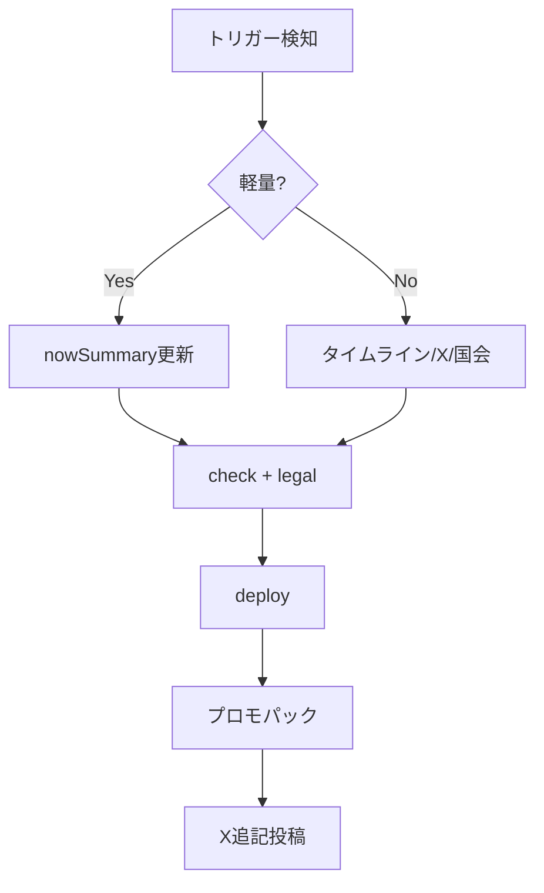

# 過去記事の更新ルーティン

最終更新: 2026-06-29  
対象: **既公開案件**に追記・修正が必要なとき

関連: `docs/publish-routine.md`（新規公開）· `docs/content-visual-strategy.md`

---

## いつ更新するか（トリガー）

| トリガー | 例 | 優先度 |
|----------|-----|--------|
| **国会で新発言** | 予算委・法案審議 | 高 |
| **国会原文がAPIに載った** | dietPending 案件の追記 | 高 |
| **政策の実施・頓挫** | 給付開始・法案廃案 | 高 |
| **Xで話題再燃** | 削除投稿・拡散 | 中 |
| **数字の訂正** | 白書・調査更新 | 高 |
| **法務指摘** | 表現の修正 | 最高 |
| **誤字・リンク切れ** | 404 | 中 |

**新規追加だけでなく、話題が動いた既存案件を週1で1本は見直す**（週次ルーティンに組込）。

---

## 更新の種類

### A. 軽量更新（30分）

`nowSummary` のみ。一覧・OGP・X文案に即反映。

```powershell
# 1. JSON編集（data/articles/{slug}.json）
#    - nowSummary.bullets を差し替え
#    - nowSummary.updatedAt = 今日（ISO）
#    - 必要なら promoHot: true

# 2. ゲート
node scripts/check-case-page.mjs --slug {slug}
node scripts/legal-check.mjs --slug {slug}

# 3. デプロイ（main push または deploy:win）
npm run deploy:win

# 4. X「追記」投稿（hook PNG 推奨）
node scripts/generate-promo-pack.mjs --slug {slug}
```

**公開状態は変えない**（`adminHidden` / `pageReady` そのまま）。

### B. 中量更新（1〜2時間）

タイムライン・国会発言・X枠の追加。

**国会待ち（`dietPending: true`）案件で原文が載ったとき:**

1. `node scripts/enrich-timeline-all.mjs --slug {slug}`
2. `node scripts/fetch-speech.mjs --slug {slug}`（必要時）
3. JSON で `dietPending: false`、`dietCheckedAt` を今日に更新
4. デプロイ後、X「国会原文が出ました」追記（hook PNG 推奨）

```powershell
node scripts/enrich-timeline-all.mjs --slug {slug}
node scripts/fetch-speech.mjs --slug {slug}   # 必要時
# xPosts 手動 or x-research スキル
node scripts/check-case-page.mjs --slug {slug}
npm run deploy:win
```

### C. 重量更新（半日）

タイトル変更・論点の組み替え・prosCons 再生成。

```powershell
node scripts/admin-article.mjs --action update_title --slug {slug} --title "新タイトル"
node scripts/generate-proscons-auto.mjs --slug {slug}
node scripts/enrich-timeline-all.mjs --slug {slug}
node scripts/legal-check.mjs --slug {slug}
npm run deploy:win
```

---

## データ上のルール

| フィールド | 新規公開時 | 更新時 |
|-----------|-----------|--------|
| `publishedAt` | 設定 | **変更しない**（初公開日の正） |
| `nowSummary.updatedAt` | 設定 | **毎回更新** |
| `fetchedAt` | API取得日 | 国会再取得時のみ |
| `ogPattern` | 省略可 | 追記告知なら `hook` を指定可 |
| `promoHot` | 任意 | 再告知週は `true` → 翌週 `false` |

---

## 告知の要否

| 更新内容 | X投稿 | はてブ |
|----------|-------|--------|
| 誤字・軽微 | 不要 | 不要 |
| nowSummary 差し替え | **推奨**（「更新」明記） | 任意 |
| タイムライン+3件以上 | **必須** | 推奨 |
| タイトル変更 | 必須 | 推奨 |

テンプレ:

```
【更新】{案件名}
{今の論点1行}

国会・Xの最新を追記しました
{URL}
#政治now
```

---

## 週次の見直しキュー（CEO）

`/dev/status/` または `data/project-status.json` で:

1. `nowSummary.updatedAt` が **30日以上前** の公開案件をリスト
2. `apiHits` 上位 or `promoHot` 案件を優先
3. 週1本を A または B で更新

```powershell
node scripts/generate-article-audit.mjs   # 要約古さ・ゲート警告
```

---

## 非表示・差し戻し

| 操作 | コマンド / UI |
|------|--------------|
| 一時非表示 | `/dev/status/` → 非表示 |
| タイトルのみ戻す | Git revert + redeploy |
| 論点が古くなりすぎ | `adminHidden: true` + 再調査後に再公開 |

---

## フロー図


