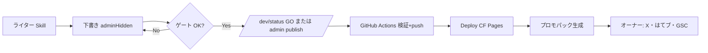

# 記事公開ルーティン

最終更新: 2026-06-28  
対象: 日本の政治なう — **1案件を本番公開するとき**の手順

関連: `docs/weekly-routine.md` · `docs/traffic-zero-cost-playbook.md` §F · `docs/pre-release.md` · `docs/article-update-routine.md` · `docs/content-visual-strategy.md`

---

## 全体像（誰が何をするか）



| フェーズ | 担当 | 所要目安 |
|----------|------|----------|
| 執筆・ゲート | CEO（Skill + スクリプト） | 案件により 30分〜 |
| 公開 GO | オーナー | 1分 |
| デプロイ | GitHub Actions 自動 | 3〜5分 |
| プロモ生成 | スクリプト / Actions 自動 | 1分 |
| SNS・SEO 投稿 | オーナー | **約30分/案件** |

---

## Phase 1 — 下書き完成（CEO）

### 1-1. 記事データ

```powershell
# 新規（例 batch10）
node scripts/batch-create-articles-batch10.mjs
node scripts/apply-writer-batch10.mjs
node scripts/finish-batch10.mjs
```

または管理画面キーワード → 既存パイプライン。

### 1-2. ゲート（必須）

```powershell
node scripts/check-case-page.mjs --slug {slug}
node scripts/legal-check.mjs --slug {slug}
```

**通過条件:** 全必須項目 ✅ · `legalReview.status: ok` · X枠 1件以上

### 1-3. プレビュー

- ローカル: `npm run dev` → `/dev/preview/{slug}/`
- 本番プレビュー: `/dev/preview/{slug}/`（adminHidden でも可）

**この時点では `adminHidden: true` のまま。本番一覧に出さない。**

---

## Phase 2 — 公開 GO（オーナー）

### 方法A: 管理画面（推奨）

1. https://seiji1192.site/dev/status/
2. 対象 slug の **GO（公開）**
3. GitHub Actions「記事管理」が `publish` を実行 → main に push → Deploy 自動

### 方法B: GitHub Actions 手動

1. **記事を本番反映** — slug 入力（検証のみ）
2. **記事管理** — action: `publish`, slug: `{slug}`

### 公開時に変わる JSON

- `publishReady: true`
- `pageReady: true`
- `adminHidden: false`（GO 時）
- `publishedAt` タイムスタンプ

### Phase A — 国会待ち先行公開

国会議事録 API にまだ載っていない案件は、**X・報道タイムラインだけで先に公開**できる。

記事 JSON に `"dietPending": true` を付ける。公開ゲートは次に緩和される。

| 通常 | Phase A（dietPending） |
|------|------------------------|
| タイムライン6件（X3+国会3） | タイムライン3件以上・**X3必須** |
| primarySpeech 必須 | sourceUrls またはタイムライン出典で可 |
| — | 画面上「国会データが更新され次第掲載」 |

**国会が載ったら:** `enrich-timeline-all` → `dietPending: false` → デプロイ → X「国会原文が出ました」追記（`docs/article-update-routine.md`）

---

## Phase 3 — デプロイ（自動）

`push main` または「記事管理」成功後:

1. `Deploy to Cloudflare Pages` ワークフロー
2. ビルド + CF キャッシュパージ
3. 本番 URL: `https://seiji1192.site/case/{slug}/`

---

## Phase 4 — プロモパック生成

### ローカル

```powershell
node scripts/generate-promo-pack.mjs --slug {slug}
# → content/promo/{slug}.md + .json
```

### GitHub Actions

- **マーケ・プロモパック生成** — workflow_dispatch で slug 指定
- 「記事管理」で `publish` 成功後、連動生成（artifact ダウンロード）

### 产出物（1案件あたり）

| # | 内容 | 用途 |
|---|------|------|
| 1 | **X 本投稿 + スレッド3** | @seiji1192site |
| 2 | **はてブ タイトル + コメント3行** | 公開日 |
| 3 | **note 抜粋300字** | 単発 or 週次に転用 |
| 4 | **SEO チェックリスト** | GSC・OGP・内部リンク |
| 5 | **PNG 制作メモ** | Canva 10分 |

---

## Phase 5 — オーナー投稿（公開日・約30分）

チェックリスト（`content/promo/{slug}.md` 末尾と同じ）:

```
□ X 本投稿（PNG 添付推奨）
□ X スレッド 2/3・3/3（任意・反応良ければ）
□ はてブ（コメント3行付き）
□ GSC → URL検査 → インデックス登録リクエスト
□ OGP プレビュー確認
□ note は週次ダイジェストに回しても可
```

**やらない:** 煽りタイトル・党派攻撃・未検証数字の追加

---

## Phase 6 — 内部リンク（CEO・公開後5分）

公開案件から既存案件へ **関連3本** を `summaryBullets` や本文導線で追加（次回更新時で可）。

playbook §A9 · タスク M33「1案件→10露出」

---

## タイミング早見表

| タイミング | アクション |
|------------|------------|
| 公開直後 | X + はてブ + GSC |
| 公開+1日 | Threads / Bluesky 短縮文 |
| 公開+3日 | 反応見てスレッド続き or 再投稿 |
| 週次月曜 | `generate-weekly-digest.mjs` → note 投稿 |

---

## コマンド一覧

```powershell
npm run promo:pack -- --slug {slug}
npm run promo:recent --           # 直近7日分
npm run promo:weekly              # note 週次文案
npm run check:case -- {slug}
npm run legal:check -- --slug {slug}
```

---

## トラブル

| 症状 | 対処 |
|------|------|
| publish 失敗 | `check-case-page` の ✗ を修正 |
| 一覧に出ない | `adminHidden` / `pageReady` を確認 |
| プロモが空 | `nowSummary.bullets` 3行あるか確認 |
| デプロイ遅延 | GitHub Actions → Deploy ログ |

---

## GitHub Workflows 対応

| workflow | 用途 |
|----------|------|
| `publish-article.yml` | 公開前検証 |
| `admin-article.yml` | publish / hide / delete |
| `deploy.yml` | 本番反映 |
| `marketing-promo-pack.yml` | プロモパック artifact |
| `marketing-weekly.yml` | 週次ダイジェスト artifact（月曜 9:00 JST） |
