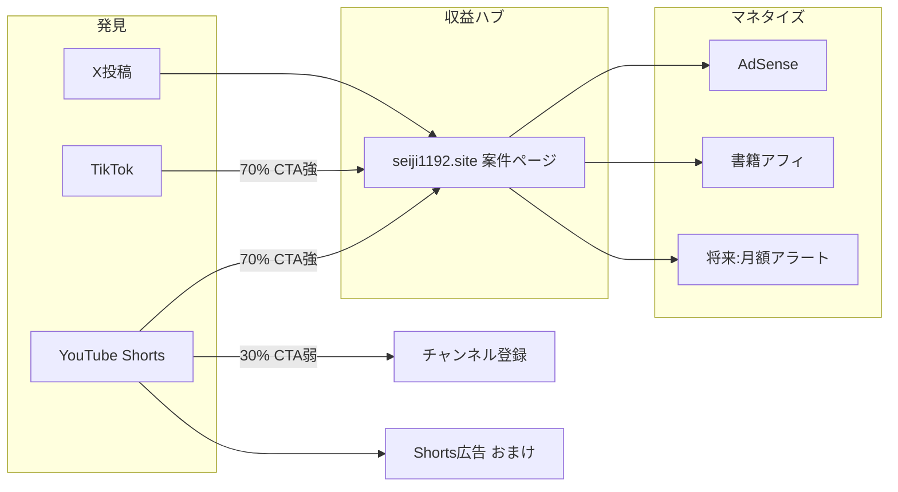

# 政治ショート動画 — ベンチマーク・型・収益構造

最終更新: 2026-06-29  
関連: `docs/shorts-pipeline.md` · `docs/monetization.md` · `docs/content-visual-strategy.md` · `docs/sns-strategy.md`

---

## 1. 結論（3行）

1. **真似するのは「型」5種** — 煽り切り抜き系は再生は取れるが政治now.のブランド・法務と相性最悪。**捨てる。**
2. **収益の主戦場はサイト** — Shorts単体の広告RPMはサイトの1/10〜1/50。ショートは**集客装置**、サイトで Ad・アフィ・将来月額。
3. **構造はハイブリッド** — 投稿の **7割はサイト誘導型**、**3割はチャンネル育成型**（CTA弱め・拡散優先）。同一案件で2バリエーション出せる。

---

## 2. 市場調査メモ（2026-06）

| 事実 | 示唆 |
|------|------|
| 衆院選関連動画 約9億再生（日経分析） | 需要は巨大。ただし **匿名切り抜き・アンチ系が再生の過半数** |
| アンチ・批判系は1本あたり平均より **+64%再生** | 追うと伸びるが **誤認・公選法・ブランド毀損**。政治now.は不採用 |
| 選挙動画の92.5%は第三者YouTuber（ファクトチェックセンター） | **「中立・記録」ポジションに隙間** — 政党PRでも切り抜きでもない |
| TikTok/Shortsは **複数クリエイティブ大量テスト** が当たり（業界標準） | 1案件1本ではなく **同一台本でテロップ色・フック文言2〜3パターン** |
| Shorts RPM 目安 **$0.01〜0.07 / 1000再生**（海外調査・日本は下振れしがち） | 100万再生でも **数百〜数千円台** が現実的。夢ない |

---

## 3. ベンチマーク — 残す / 捨てる

### ✅ 残す（参考チャンネル・方向性）

| # | 参考 | 学ぶこと | 政治now.への転用 |
|---|------|----------|------------------|
| **B1** | [選挙ドットコムちゃんねる](https://www.youtube.com/@thesenkyo) | データ・論点整理・専門家対談の切り出し | **数字＋論点3つ**の信頼感トーン |
| **B2** | [社會部部長](https://www.youtube.com/@%E7%A4%BE%E6%9C%83%E9%83%A8%E9%83%A8%E9%95%B7) / [地政科学部](https://www.youtube.com/@%E5%9C%B0%E6%94%BF%E7%A7%91%E5%AD%A6%E9%83%A8) | 社会・政治を **構造で短く** | テロップ多め・図解風レイアウト |
| **B3** | [葦原大和 DEEP MAX](https://www.youtube.com/@DEEPMAX) | 「なぜ今？」の **フレーム提示** | 冒頭3秒フックの言い回し |
| **B4** | [世界見聞録](https://www.youtube.com/@%E4%B8%96%E7%95%8C%E8%A6%8B%E8%81%9E%E9%8C%B2) | 専門用語を削った **平易語** | サイトの「つまりこういうこと」をそのまま音声化 |
| **B5** | 日経・各社の **知事選ショート**（2024〜） | 政治家本人の **15〜30秒主張** | 自社は **第三者解説** で差別化（スクショ＋国会引用） |

### ❌ 捨てる（伸びるが採用しない）

| 型 | 理由 |
|----|------|
| アンチ政党・人格攻撃切り抜き | 再生は取れるが KPI・法務・オーナーポリシーと逆行 |
| ゆっくり解説（キャラ依存） | 制作コスト・二次創作ガイドライン・ブランド不一致 |
| 顔出し論客パロディ | 実名・肖像リスク。匿名運営と矛盾 |
| 横型CMの縦切り | TikTok業界でも非推奨。完走率が落ちる |

### 📌 これから集める「良い1本」リスト（手動）

着手時に **各型2本ずつ** URLを `data/shorts-benchmarks.json` に蓄積する。

| 型ID | 名前 | 尺 | 収集状態 |
|------|------|-----|----------|
| **P1** | 数字フック型 | 25〜35s | 未 |
| **P2** | 国会vsX対比型 | 35〜45s | 未 |
| **P3** | 引用＋テロップ型 | 30〜40s | 未 |
| **P4** | 週次ダイジェスト型 | 45〜60s | 未 |
| **P5** | 用語1分（※30秒圧縮） | 25〜35s | 未 |

---

## 4. 採用する5パターン（制作テンプレ）

### P1 — 数字フック型（集客・サイト誘導 **主役**）

```
[0-2s]  テロップ大文字「出生率、3.6兆は効いた？」
[2-18s] 平易語3行（記事 nowSummary から）
[18-24s] Xスクショ or 国会引用1枚
[24-30s] 「続き・出典つき → 政治now」+ URL
```

- OGP `-number` パターンと **同じフック** を使う（XとShortsで認知統一）
- **CTA必須**

### P2 — 国会 vs X 対比型（差別化・拡散）

```
[0-3s]  「本会議ではA、XではB」
[3-25s] 左右 or 切替で2ソース（テロップ＋スクショ）
[25-32s] 「削除済みも記録」→ サイト
```

- `sns-strategy.md` の拡散テンプレを映像化
- 法務：公人発言・取得日時・リンク併記

### P3 — 引用ドン型（信頼・保存）

```
[0-2s]  発言者名＋党名（テロップ）
[2-22s] 国会抜粋 or Xスクショ（大きく）
[22-28s] 一言解説「つまり〇〇」
[28-32s] ソフトCTA
```

- サイトの `primarySpeech` / `-quote` OGP と連動

### P4 — 週次3本ダイジェスト（チャンネル育成）

```
[0-5s]  「今週の政治now 3選」
[5-50s] 案件×3（各15秒）
[50-55s] チャンネル登録のみ（URLは概要欄）
```

- **CTA弱め** — サブスク・再訪用
- 毎週日曜固定など

### P5 — 用語サクッと型（検索・TikTok向け）

```
[0-2s]  「インボイス2割特例、まだ続く？」
[2-25s] 用語→一言→誰が得するか
[25-30s] 案件URL
```

- 記事の用語ブロックから自動生成しやすい

---

## 5. 収益構造 — Shorts単体 vs サイト誘導

### ざっくり試算（月間）

| レーン | 前提 | 月収目安 |
|--------|------|----------|
| **Shorts広告のみ** | 50万再生/月・RPM ¥30 | **¥15,000** |
| **サイト AdSense** | 3万PV・RPM ¥150 | **¥4,500**（初期） |
| **サイト AdSense** | 10万PV・RPM ¥150 | **¥15,000** |
| **サイト＋アフィ** | 10万PV・CTR2%・成約月10 | **+¥5,000〜15,000** |
| **サイト＋月額** | 50人×¥500 | **¥25,000** |

**同じ労力ならサイト10万PVの方がレーンが積み上がる。** Shortsは「PVを運ぶパイプ」。

### 推奨ファネル



### 投稿カテゴリ分け

| カテゴリ | 割合 | CTA | 目的 |
|----------|------|-----|------|
| **Funnel** | 70% | 画面下URL・概要欄・固定コメント | サイトPV・アフィ・滞在 |
| **Grow** | 30% | 登録・いいねのみ | 再生・フォロワー |
| **Digest** | 週1本 | 弱 | チャンネル定着 |

### プラットフォーム優先順位

1. **YouTube Shorts** — 検索耐性・概要欄リンク・AdSense連動・長期資産
2. **X** — 既存運用。動画は **15〜45秒ネイティブ** でリンク付き（サイト送客）
3. **TikTok** — 拡散テスト用。リンク制約強い → **プロフィール誘導** 前提

---

## 6. KPI（ショート施策）

| 指標 | 3ヶ月目標 | なぜ |
|------|-----------|------|
| Shorts本数 | 累計30本 | 型の当たり外れ検証 |
| サイト参照流入（YT） | 週500セッション | 収益に直結 |
| Shorts→サイトCTR | 3%以上 | 概要欄＋画面CTAの効き |
| 完走率 | 60%以上 | 尺30秒以内・フック2秒 |
| 当たり型 | P1 or P2 が1つ特定 | 以降その型を厚く |

**追わないもの（初期）**: Shorts RPM単体、100万再生バイラル

---

## 7. 制作・運用ルール

| 項目 | 方針 |
|------|------|
| 尺 | **25〜35秒** 基本（P4のみ45〜60秒） |
| 解像度 | 1080×1920 固定 |
| 音声 | TTS統一（声のブランド化） |
| テロップ | 句読点同期・1画面12字以内 |
| 映像 | 国会議事堂ストック / 記事OGP / Xスクショ / ニュース風下帯 |
| 同一案件 | **最低2パターン**（P1 funnel + P3 grow など） |
| 法務 | 煽り禁止・出典表示・公選法期間はテンプレ差替 |

---

## 8. 実行フェーズ

| Phase | 内容 | 成果物 |
|-------|------|--------|
| **0（今）** | ベンチマークURL各型2本収集 | `data/shorts-benchmarks.json` |
| **1** | P1で手動1本（shoshika） | 当たり外れ確認 |
| **2** | P1〜P3 自動パイプライン | `ceo-kv-short-video-pipeline` |
| **3** | 週3本 Funnel + 月4本 Grow | 運用定着 |
| **4** | 当たり型のみ TikTok 横展開 | レコメンド学習 |

---

## 9. ops-queue 連携

- `ceo-kv-short-video-pipeline` — 自動化実装
- `ceo-kv-shorts-benchmarks` — 参考動画収集・型確定（本doc Phase 0）
